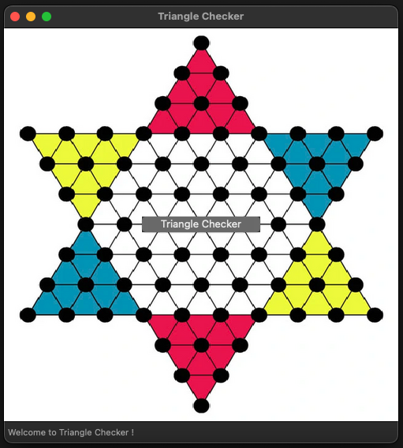
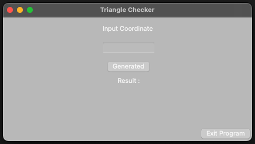

# Siakad & Triangle Checker GUI Using Wxwidgets C++

## Description

This is simple GUI ( Graphical User Interface ) program for siakad and triangle checker. This GUI using wxwidgets framework or library in C++. This project is made to fulfill final project, advanced programming

## Getting Started

### Preview

1. GUI Siakad :

   
   
   

2. GUI Triangle Checker:

   
   

### How to Run

1. Clone this repository. If you dont know how to clone repository, check this out : https://docs.github.com/en/repositories/creating-and-managing-repositories/cloning-a-repository
2. After you done cloning, if you just only want to run, open folder GUI_Siakad or GUI_TriangleChecker in integrated terminal then type "./gui"
3. But if you want to modify the source code etc, then you must instal wxwidgets first.
4. Since im using MacOS, here tutorial to instal wxwidgets in MacOS : https://siytek.com/macos-gui-cpp/#Download-and-Install-CMake
5. Enjoy running the program ❤️

## Contact

If you have any question or feedback, please do not hesitate to contact me any time
Mahijapradipta86@gmail.com

# Made with passion by Eeja ❤️
